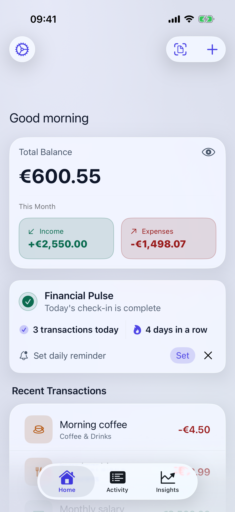
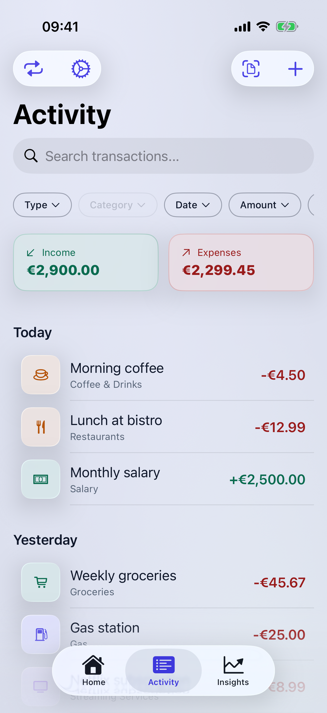
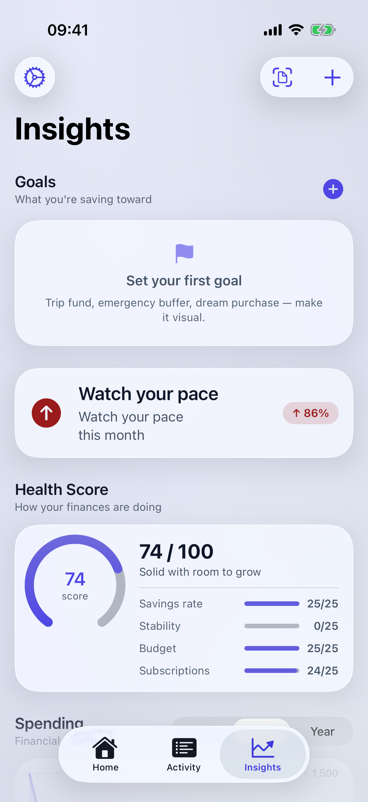
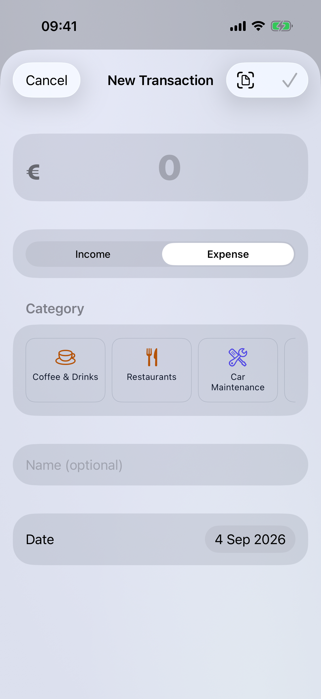

# Personal Finance Tracker · iOS

A personal finance app for tracking income and expenses, understanding spending patterns, and staying on top of your finances.

**Requirements:** iOS 26+

---

## Features

- **Dashboard** — total balance, income/expense summary for the current pay cycle, and recent transactions
- **Activity** — full transaction list with grouped history, live search with type/date/amount filters, and swipe-to-delete with undo
- **Insights** — health score, spending forecast, goal pockets, habit insights, category trends and charts
- **Categories** — customizable categories with icons and colors
- **Add / Edit transactions** — quick entry sheet with category, amount, date, and notes
- **Import / Export** — CSV and Excel import with column & category mapping; CSV/Excel export
- **Security** — Face ID / Touch ID and PIN lock; PIN-confirmed delete-all-data
- **Profile** — pay cycle configuration and personal info

## Screenshots

| Dashboard | Activity | Insights | Add transaction |
|---|---|---|---|
|  |  |  |  |

Dark mode and the iPad sidebar layout are in [`docs/screenshots/`](docs/screenshots).
Regenerate the whole set with `scripts/screenshots` (add `--ipad` for the iPad pass).

## Tech Stack

| Layer | Technology |
|---|---|
| Language | Swift 6 |
| UI | SwiftUI |
| Persistence | SwiftData |
| Architecture | MVVM |
| Tests | Swift Testing |

## Work in Progress

- iCloud sync
- Budgeting / spending limits
- Recurring transactions
- Home-screen widgets

## Development

Open `PersonalFinanceTraker/PersonalFinanceTraker.xcodeproj` in Xcode. Build and run on a simulator or device running iOS 26+.

> **Note:** The project directory is spelled `PersonalFinanceTraker` (one 'c') — this is a known typo carried throughout the Xcode project.
